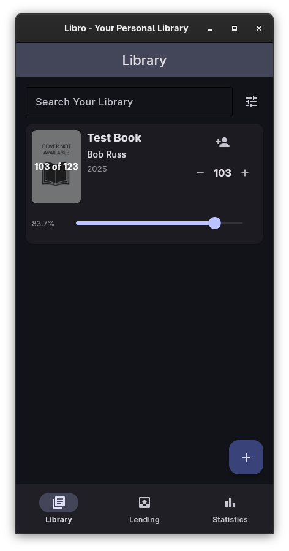
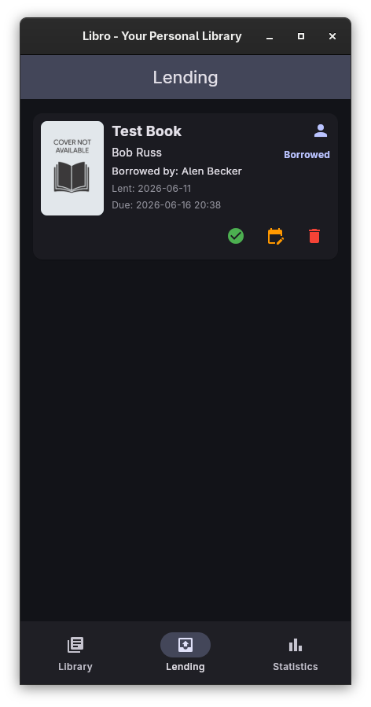
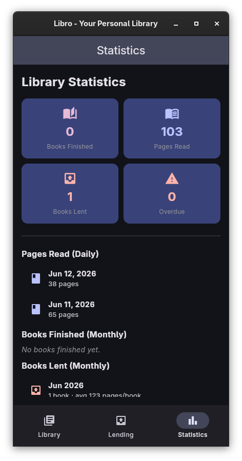
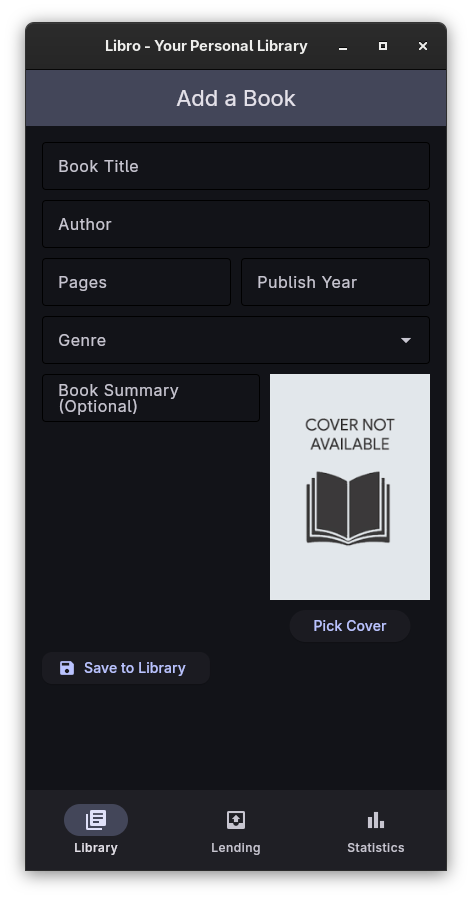
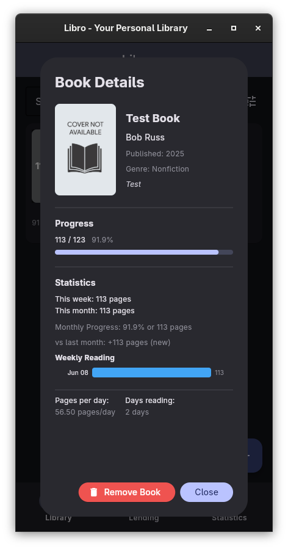
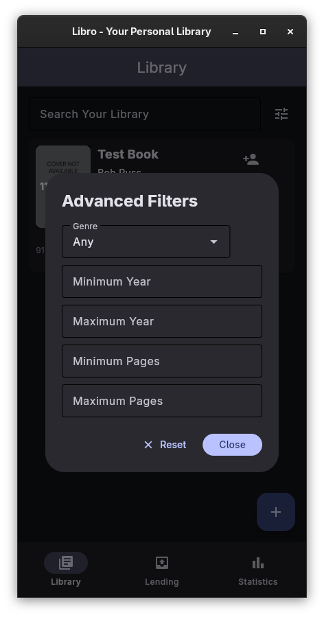
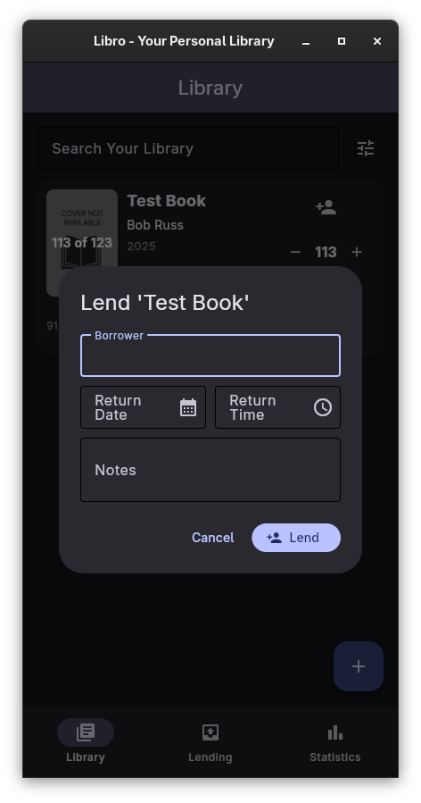
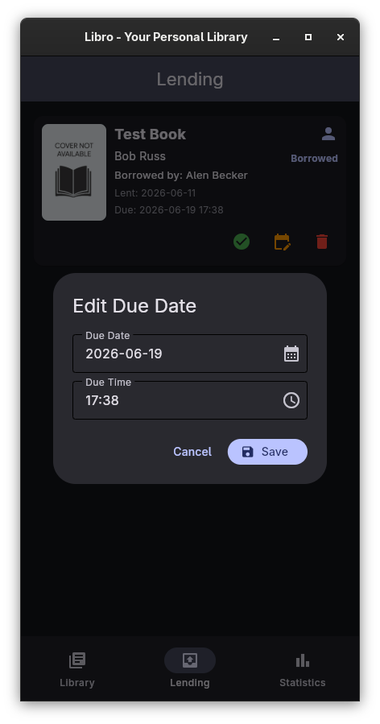

# Libro - Your Personal Library


Collage Project, A personal library management app built with [Flet](https://flet.dev/).

## Features

- **Library Management**: Add/remove books with detailed information and cover images.
- **Reading Progress**: Track how much of each book you have read.
- **Lending System**: Lend books to friends and keep a record of who has borrowed what.
- **Statistics**: View statistics on reading habits and lending activity.
- **Advanced Search**: Quickly find books using advanced search filters.
- **Responsive UI**: Clean, modern interface built with Flet.

## Screenshots

| Feature | Screenshot |
| --- | --- |
| Library Tab |  |
| Lending Tab |  |
| Statistics |  |
| Add Book |  |
| Book Details |  |
| Advanced Search |  |
| Lend Book |  |
| Edit Lending |  |

## Todo List

- [x] Json storage
- [x] Logo Design
- [x] Add/Remove books with details and cover image
- [x] Track reading progress in the library
- [x] Lending books from the library
- [x] Statistics for reading/lending books
- [ ] Make sure the app is stable
- [ ] Make sure there is no visual errors

## How to Run

This project uses [Astral UV](https://docs.astral.sh/uv/) for Python package and project management.

### Prerequisites

Install UV if you haven't already:

```bash
curl -LsSf https://astral.sh/uv/install.sh | sh
```

### Run the app

```bash
# Clone the repository
git clone https://github.com/amiralimollaei/libro.git
cd libro

# Install dependencies
uv sync

# Run the app
uv run libro
```

Alternatively, you can use the Flet CLI directly:

```bash
flet run
```
